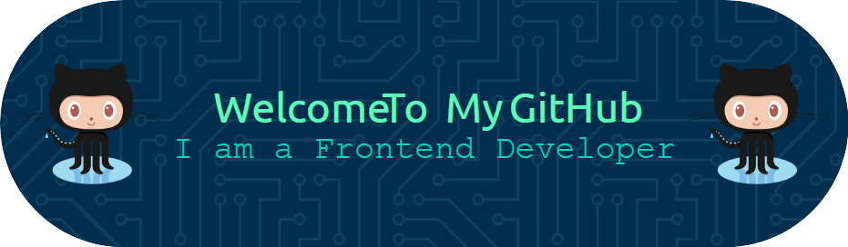

# 💫 About Me:
🔭 I’m currently working on on website for Greenfield Agro Services Checkout Here: 👉https://greenfield.asia/ 🔭 I’m currently working on on website for Penta Spirit. Checkout Here: 👉https://pentaspirit.com/  🤝 I’m looking for help with learning concepts of MERN stack. 🌱 I’m currently learning MERN Stack.

## 🌐 Socials:
         

# 💻 Tech Stack:
                      
# 📊 GitHub Stats:
 
 

## 🏆 GitHub Trophies

### ✍️ Random Dev Quote

### 🔝 Top Contributed Repo

### 😂 Random Dev Meme

---

  ## 💰 You can help me by Donating
   

  
<!-- Proudly created with GPRM ( https://gprm.itsvg.in ) -->
